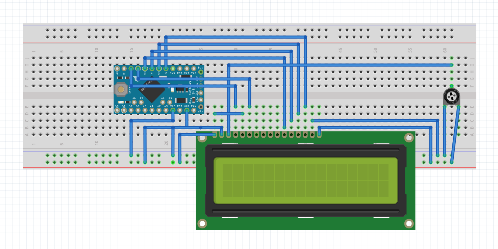

LCD1602液晶引脚说明

<table cellspacing="0" class="t_table" style="width:50%"><tbody><tr><td> pin</td><td> 名称</td><td> 注释</td></tr><tr><td> 1</td><td> VSS</td><td> 电源地</td></tr><tr><td> 2</td><td> VDD</td><td> 电源正极</td></tr><tr><td> 3</td><td> VL</td><td> 液晶显示偏压信号</td></tr><tr><td> 4</td><td> RS</td><td> 数据/命令选择端（H/L）</td></tr><tr><td> 5</td><td> R/S</td><td> 读/写选择端（H/L）</td></tr><tr><td> 6</td><td> E</td><td> 使能信号</td></tr><tr><td> 7</td><td> D0</td><td> Data I/O</td></tr><tr><td> 8</td><td> D1</td><td> Data I/O</td></tr><tr><td> 9</td><td> D2</td><td> Data I/O</td></tr><tr><td> 10</td><td> D3</td><td> Data I/O</td></tr><tr><td> 11</td><td> D4</td><td> Data I/O</td></tr><tr><td> 12</td><td> D5</td><td> Data I/O</td></tr><tr><td> 13</td><td> D6</td><td> Data I/O</td></tr><tr><td> 14</td><td> D7</td><td> Data I/O</td></tr><tr><td> 15</td><td> BLA</td><td> 背光源正极</td></tr><tr><td> 16</td><td> BLK</td><td> 背光源负极</td></tr></tbody></table>

[code](./displayinfo/displayinfo.ino)
